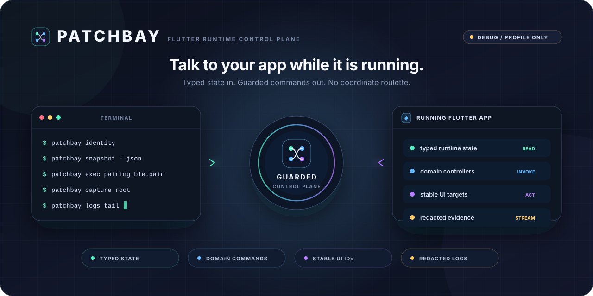
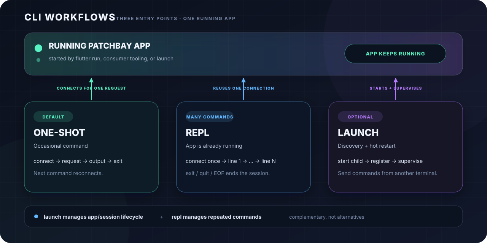
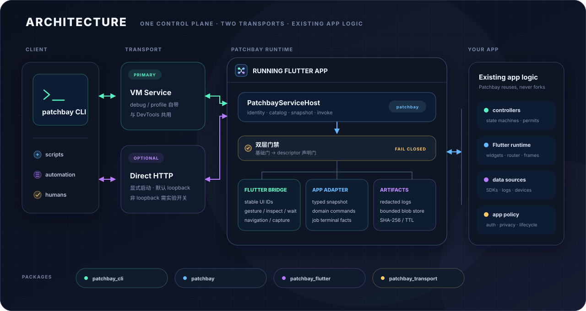

# Patchbay

<p align="center">
  
</p>

<p align="center">
  <strong>Talk to your running Flutter app the way adb talks to a device.</strong>
</p>

<p align="center">
  <a href="https://github.com/cr1992/patchbay/blob/main/README.md">English</a> | 简体中文
</p>

<p align="center">
  <a href="#适合解决什么问题">适用场景</a> ·
  <a href="#快速开始">快速开始</a> ·
  <a href="docs/quickstart.md">英文十分钟路径</a> ·
  <a href="#能做什么">核心能力</a> ·
  <a href="#架构与包">架构</a> ·
  <a href="docs/guide.md">使用指南</a> ·
  <a href="docs/design.md">设计</a>
</p>

Patchbay 是一条伸进 Flutter runtime 的类型化控制通道：从终端连接正在运行的 App，
读取带来源的状态、调用业务命令、按稳定 ID 操作控件，以及获取脱敏日志和截图。

adb 站在系统外面看设备；Patchbay 站在 App 里面看 runtime。对 iOS 来说，它补上了
系统工具无法提供的 App 内部调试面。

> **项目状态：** `v0.5.0`；需要 Dart `>=3.12.0`，Flutter UI 能力需要
> Flutter `>=3.44.0`。控制面仅在 debug / profile 启用；package 可以参与 release 编译，但接入方
> 必须在组合根通过编译期分支让 host 与 adapter 保持不可达。

## 适合解决什么问题

| 使用 Patchbay | 继续使用 adb / xcrun |
|---|---|
| 读取 App 内部类型化状态 | 安装、卸载和启动 App |
| 调用 App 主动开放的业务命令 | 执行系统 shell |
| 操作 Flutter Semantics 或稳定 UI ID | 安装、启动和检查其他 App |
| 通过显式外部 driver 编排预期系统权限弹窗 | 通用系统 UI 自动化或坐标驱动的弹窗处理 |
| 获取 App 侧脱敏日志与 Flutter 截图 | 获取完整物理屏幕或原生 `PlatformView` 内部状态 |

Patchbay 不是 adb 的替代品，也不是坐标驱动的黑盒测试框架；两者组合使用才是完整的调试工具链。

## 快速开始

下面用 VM Service 跑通最短链路，并把 Patchbay 接入你自己的 App。如果只想先看 Patchbay 本身能不能
跑通，用仓内自带的示例 App 即可，不用写一行 Dart：见英文的
[10-minute quick path](docs/quickstart.md)（一次 `snapshot`、一次安全的 `ui perform` 写操作、一次
`capture`）。完整的门禁、业务命令、会话发现和 direct HTTP 接入见[使用指南](docs/guide.md)。

### 1. 添加 Flutter 依赖

日常接入直接使用 hosted package：

```yaml
dependencies:
  patchbay_flutter: ^0.5.0
```

`patchbay_flutter` 已导出 core 的默认 consumer API；纯 Dart 接入可改用 `packages/patchbay`。

0.6.0 起公共 Dart 面按角色分层，每个入口都是逐名列出的封闭 `show` 清单：

| import | 角色 | 符号数 |
|---|---|---|
| `package:patchbay/patchbay.dart` | 默认 consumer：命令注册与 descriptor、参数/响应 schema、gate、catalog 与 snapshot provider、job、artifact、log、navigation 与 UI 声明 | 98 |
| `package:patchbay/patchbay_host.dart` | host implementer：默认清单的严格超集，再加 `PatchbayServiceHost`、audit、invocation/cancellation 与 validation lifecycle | 136 |
| `package:patchbay/patchbay_protocol.dart` | protocol / wire implementer：生成 wire 类型、catalog capability 与 digest、CLI syntax、permission companion、client 请求与 canonical descriptor | 141 |
| `package:patchbay_flutter/patchbay_flutter.dart` | widget 文件：core 默认清单加 `PatchbayKey`、`PatchbayRoot`、`PatchbayRootController`、`PatchbayUiRegistry` | 102 |
| `package:patchbay_flutter/patchbay_flutter_host.dart` | Flutter 组合根：core host 清单加全部 Flutter service host、bridge 与 policy 符号 | 195 |

每个入口都是**自足**的：导出符号的公共签名里出现的 Patchbay 类型一定由同一个入口导出，所以照迁移表
改完不会拿到 `undefined_class`。这是被机检的不变量，不是意图。它也意味着几份清单**有意重叠**，并且
默认面里会有少量 `*Wire` 类型——它们正是实现 `PatchbayLogSource` 时必须能命名的那些。

默认入口收窄是 0.6.0 明示的 source breaking，不提供 `legacy.dart`：旧 import 会编译失败，按
[迁移表](docs/guide.md#05x--060-source-迁移表)逐项替换即可。wire、错误码、稳定 JSON 与 CLI 输出
都不受影响。

### 2. 安装 CLI

下面以 macOS arm64 为例，默认安装 GitHub Release 提供的原生 AOT 二进制；其他平台及
`checksums.txt` 校验方式见[使用指南的安装节](docs/guide.md#cli)：

```console
$ mkdir -p ~/.local/bin
$ curl -fL https://github.com/cr1992/patchbay/releases/download/patchbay-v0.5.0/patchbay-0.5.0-macos-arm64 \
    -o ~/.local/bin/patchbay
$ chmod +x ~/.local/bin/patchbay
$ patchbay --help
```

确保 `~/.local/bin` 在 `PATH`。`dart pub global activate patchbay_cli` 安装的是由 Dart runtime
加载的 app snapshot，并非独立原生 AOT；它可以作为兼容形态使用，但不应拿它验证 AOT 启动耗时。
需要该兼容形态时，按同一 package 版本固定安装：

```console
$ dart pub global activate patchbay_cli 0.5.0
```

### 3. 在组合根注册

```dart
import 'package:flutter/foundation.dart';
import 'package:flutter/material.dart';
// 组合根属于 host 角色：这一个 import 同时覆盖 widget 面。
import 'package:patchbay_flutter/patchbay_flutter_host.dart';

void main() {
  if (!kReleaseMode) {
    final gates = PatchbayGateEvaluator(
      // 开放最小只读面。
      baseGate: () => const PatchbayGateDecision.allow(),
      // 写操作会声明 consumer gate；未知门保持关闭。
      consumerGate: (id) => PatchbayGateDecision.reject(
        code: 'unknownConsumerGate',
        notice: '没有叫 "$id" 的 consumer gate。',
      ),
    );

    PatchbayFlutterServiceHost(
      applicationId: 'com.example.app',
      bridge: PatchbayFlutterBridge(gates: gates),
    ).register();
  }

  runApp(const MyApp());
}
```

这会开放只读诊断；写操作在 App 声明并授权对应 gate 前保持关闭。领域命令、稳定 UI 目标、截图、
日志和导航都是[接入指南](docs/guide.md#app-接入)里的可选增量。

### 4. 连接运行中的 App

运行 App，复制 `flutter run` 输出的 VM Service URI。Patchbay 同时接受 `http(s)` 和 `ws(s)` URI：

```console
$ flutter run
$ patchbay --ws-uri '<VM Service URI>' identity
$ patchbay --ws-uri '<VM Service URI>' catalog
$ patchbay --ws-uri '<VM Service URI>' --json snapshot
```

`identity` 返回与你接入时一致的 `applicationId`，且三条命令都以 `0` 退出（`--json` 输出没有
`error` 信封），就表示最小只读链路已经跑通。普通 Patchbay 命令都是一次性进程：完成连接、请求和
输出后立即按结果退出，App 继续运行；下一条命令会重新连接同一个 App。

VM Service URI 通常包含认证信息，不要把它写入脚本、日志或提交物。接入 launcher 后可以把
`--ws-uri` 省略，详见[会话自动发现](docs/guide.md#6-会话自动发现可选)。多台设备同时连着时用
`patchbay sessions list` 看有哪些会话、`patchbay session use <session-id>` 固定一个，之后的命令
不必再逐条敲 `--session`，详见[会话选择](docs/guide.md#会话选择)。

#### 日常工作流怎么选

<p align="center">
  
</p>

- **默认：** 保持 `flutter run` 运行，偶尔查一条就用一次性命令。
- **连续执行：** App 已经运行时进入 `repl`；它复用连接，不负责启动 App。
- **自动发现：** 接好 session 声明后，终端 A 用 `launch` 监督 App，终端 B 跑普通命令或 `repl`。

`launch` 与 `repl` 可以配合，并非二选一；连接异常先跑 `patchbay doctor`。完整退出条件和双终端示例
只在[使用指南的「先选工作流」](docs/guide.md#先选工作流)维护。

## 能做什么

| 能力 | Patchbay 提供什么 |
|---|---|
| **状态** | `snapshot` 类型化快照，每个值带事实来源（App 记账 / 命令回显 / 设备上报 / UI 观测）；可按点路径只取一个字段，也可让 App 侧等某个字段满足条件 |
| **业务命令** | 接入方注册的领域命令直调既有 controller；长流程走 job（受理 / 事件 / 终态） |
| **UI 操作** | 文本输入、Semantics action、三种诊断树、截图和条件等待，只作用于明确开放的目标 |
| **日志** | query / tail / export，所有出口统一脱敏 |
| **导航** | 按稳定 destination ID 跳转，不暴露任意 route 字符串 |
| **连续执行** | `repl` 在一次连接内逐行跑 typed 命令，每行自带退出码 |
| **帮助** | 由命令声明生成，使用 `patchbay help <topic>` 查看 |

```console
$ patchbay identity
$ patchbay --json snapshot
$ patchbay --wait exec example.job.run
$ patchbay ui semantics tree
$ patchbay ui perform tap semantics:login.submit <generation> --via semantics
$ patchbay --output screen.png capture root
$ patchbay logs tail
$ patchbay repl < commands.txt
```

用 `patchbay help <topic>` 查看随包语法，用 `patchbay catalog` 查看当前 App 实际开放的能力；完整生成表
只在 [CLI 包参考](packages/patchbay_cli/README.zh-CN.md)维护。

## 为什么是 Patchbay

普通外部自动化看到的是像素、文案和坐标；Patchbay 看到的是 App 主动暴露的语义与事实：

- **可信**：状态值携带事实来源，受理、执行和设备完成性不混为一谈；
- **可控**：每条命令经过基础门与声明门，只触达 App 明确开放的能力；
- **稳定**：UI 目标使用稳定 ID 和 generation 围栏，不依赖坐标、树序号或易变文案；
- **可裁剪**：接入方用编译期分支让 host 与 adapter 在 release 不可达，不留运行时重开入口。

这些不是传输层替 App 做出的保证。领域完成性、隐私脱敏、release 产物扫描和平台行为仍由接入方
根据自己的 controller、构建链与真机结果负责。设计理由见[六条设计立场](docs/design.md#六条设计立场)。

## 架构与包

<p align="center">
  
</p>

CLI 只面对统一协议。VM Service 是默认主通道；direct HTTP 是显式开启的可选通道。进入 App 后，
所有操作先过门禁，再分别交给 Flutter bridge、业务 adapter 或 artifact service；真正的状态机、
router、设备 SDK 和隐私策略仍由 App 自己拥有。

| Package | 依赖 | 职责 |
|---|---|---|
| [`patchbay`](packages/patchbay) | 纯 Dart | 协议、命令声明、信封、事实来源、门禁、job、blob |
| [`patchbay_cli`](packages/patchbay_cli) | 纯 Dart | CLI、会话发现、VM Service / direct client、输出与退出码 |
| [`patchbay_flutter`](packages/patchbay_flutter) | Flutter | Key / Semantics 操作、截图、导航与等待 |
| [`patchbay_transport`](packages/patchbay_transport) | 纯 Dart | 可选 direct HTTP；默认关闭，必须显式启动 |

业务 DTO、设备 SDK、路由和领域词汇都留在接入方 adapter，不进入这四个通用 package。

## 术语速查

| 文档术语 | 含义 |
|---|---|
| consumer / 接入方 | 使用 Patchbay 的 App 或它的适配层 |
| descriptor / 命令声明 | 命令名、参数、门禁、副作用和事实来源的结构化描述 |
| gate / 门禁 | App 在每次操作前执行的准入判断 |
| generation / 代际 | UI 目标每次重新挂载时变化的防误击版本号 |
| job / 长任务 | 通过事件与类型化终态表达的异步业务操作 |

## 文档

- **[10-minute quick path](docs/quickstart.md)** — 只用仓内示例 App 走通 install、`identity`、
  `catalog`、`snapshot`、一次安全的 `ui perform` 写操作与 `capture`（英文）
- **[使用指南](docs/guide.md)** — 安装、App 接入、CLI 手册、退出码与边界
- **[设计](docs/design.md)** — 架构、六条设计立场与传输选型
- **[Core package](packages/patchbay/README.zh-CN.md)** — 协议、信封、门禁、job 与 blob
- **[Flutter package](packages/patchbay_flutter/README.zh-CN.md)** — UI 观察、操作、导航与截图
- **[CLI package](packages/patchbay_cli/README.zh-CN.md)** — 完整命令和连接安全
- **[Direct transport](packages/patchbay_transport/README.zh-CN.md)** — HTTP 协议与 LAN 风险
- **[Agent Skill](skills/use-patchbay/SKILL.md)** — AI agent 的只读优先任务路由与 live discovery
- **[变更记录](CHANGELOG.md)** — 未发布与已发布的 API、协议和安全行为变化

## License

[MIT](LICENSE)
