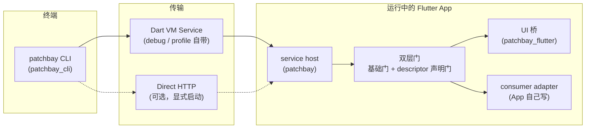
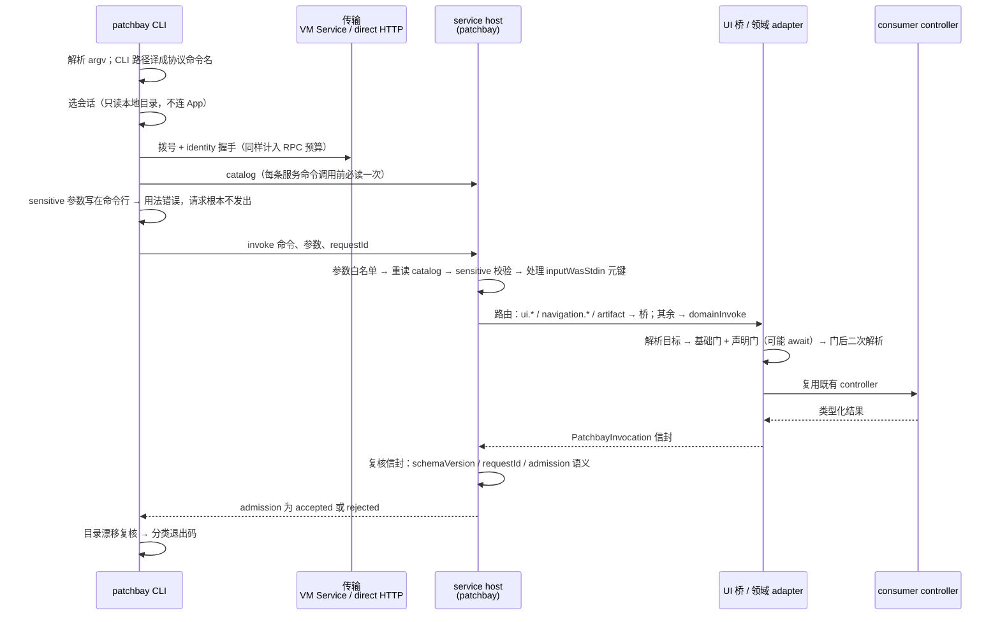
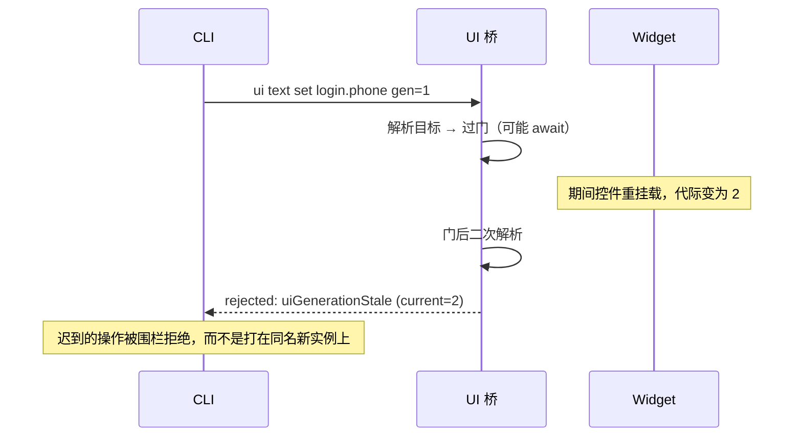
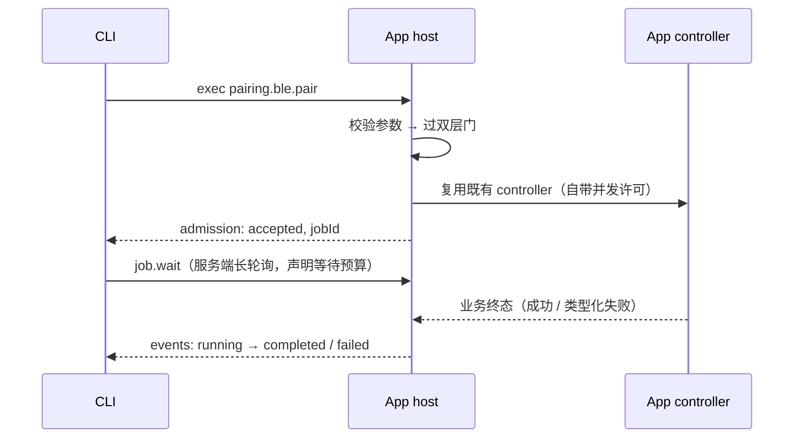

# 设计

> 本文回答"为什么长这样"。怎么用见 [使用指南](guide.md)。

## 架构

依赖方向是治理边界：`patchbay` 与 `patchbay_cli` 是纯 Dart，`patchbay_flutter` 只依赖
Flutter 与 `patchbay`。接入方（consumer）的设备 SDK、路由字符串和领域词汇不进入这四个 package；
需要这些类型时，先在接入方 adapter 中转成中立 DTO。

## 一条请求的生命周期

上面那张图说的是"谁依赖谁"。这一节说的是"一条命令实际走过哪些关口"——新接入方排查
"我的命令为什么被拒"时，先在这张图上定位是哪一层说的话，再去读对应的稳定 code。

### requestId 贯穿全程，三处独立校验

`requestId` 由客户端生成（VM Service 路径是 `patchbay-cli-vm-<n>`），随 invoke 发出，
沿途三处各自校验一次，任何一处对不上都不是"猜"，而是稳定拒绝：

1. **host 收到时**——参数里没带就自己补一个 nonce；带了但为空串，以 invalidParams 拒绝；
2. **host 拿到 adapter 回程信封时**——信封里的 `requestId` 与本次请求不一致，整条应答被替换成
   `providerProtocolViolation`（`details.reason: requestIdMismatch`），adapter 的原始 payload 不外发；
3. **CLI 收到应答时**——顶层 `requestId` 与自己发出的不同，抛 `requestIdMismatch`。

桥被 `PatchbayFlutterServiceHost` 调用时沿用传入的 `requestId`；只有在被直接调用且调用方没给 ID
时才生成本地 ID。所以日志、CLI 输出和信封能稳定关联到同一次请求。

### 谁能拒绝，用什么码

| 关口 | 典型稳定 code | 退出码 |
|---|---|---|
| CLI 用法（`--args` 塞 sensitive、参数形状不对） | `usageError` | 64 |
| 会话选择 / 拨号 / 对端不应答 | `sessionAmbiguous`、`appUnresponsive`、`transportError` | 3 |
| 协议不兼容、目录里没有该命令、目录漂移 | `schemaVersionMismatch`、`commandNotRegistered`、`catalogInvocationDrift` | 4 |
| host 前置校验（目录不可用、敏感值未走 stdin） | `providerProtocolViolation`、`sensitiveInputRequiresStdin` | 5 |
| 桥 / adapter 受理前拒绝（门、目标歧义、代际过期、生命周期） | `uiTargetAmbiguous`、`uiGenerationStale`、`*LifecycleNotResumed` | 5 |
| 已受理但业务返回类型化失败 | payload 里的 `outcome: failed` / job 终态 `failed` | 6 |

这张表跨了两种信封，别当成一种：

- **App 说的话**——`commandNotRegistered` 及第四、五行，是 `admission: rejected` 的响应信封，
  带 `rejection.code` 与自由 `details`；最后一行则是 `admission: accepted`，失败事实在 payload 里。
  受理与执行刻意不混，理由见[受理 ≠ 执行](#1-受理--执行)。
- **CLI 说的话**——用法、会话、传输，以及 CLI 侧的协议复核（`schemaVersionMismatch`、
  `catalogInvocationDrift`），App 根本没表态或表态没通过复核，走 CLI 自己的错误信封
  `{"error": {"code": …, "details": …}}`。

两种信封字段同构（稳定 `code` + 自由 `details`），所以一个解析器读两种；但"谁拒绝的"要看
它出现在哪一种里。

目录违规是**整份**失效而不是跳过坏行：host 发现命令名非法或重名时，应答里干脆没有 `commands`
键，并在 `details.violations` 里一次列全所有违规项。跳过坏行会让接入方以为自己只是少注册了几条
命令，而不是目录本身坏了。

### job 的异步分支

长流程命令受理即返回 `admission: accepted` + 顶层 `jobId`，controller 在 App 侧继续跑。
CLI 侧 `--wait` 有两条路，取决于 catalog 里有没有 `patchbay.job.wait`：

- **有**——服务端长轮询循环：每轮带 `afterSequence`（已见过的最大事件序号）与 `timeoutMs`
  （剩余预算，单轮夹到 30 秒），收到终态快照即返回，结果标 `waitMode: serverLongPoll`；
- **没有**——退化为按固定间隔轮询 `patchbay.job.get`，结果标 `waitMode: legacyPolling`
  并附一句说明。这是对老 host 的兼容路径，不是推荐形态。

两条路都在总预算耗尽时以 `waitTimeout`（退出码 6）收尾，`details.jobId` 指明是哪个 job。
终态结果里**顶层 `jobId` 是稳定取值位置**——`payload.jobId` 是 App 自己的快照字段，两处都保留，
脚本读顶层那个。job 事件语义与取消的终态规则见[慢事实用 job 表达](#6-慢事实用-job-表达)。

> **`patchbay.job.get|wait|cancel` 是接入方 adapter 的命令，不由这四个 package 注册。**
> 本仓提供 `PatchbayJobRegistry`（账本、预算、取消 callback 语义），把它接成协议命令是接入方的事。
> 没接就没有 job 面，CLI 的 `--wait` 也就无从谈起。

## 为什么需要 App 合作接入

Patchbay 不是 adb 那种对任意 App 生效的外部工具：它要求 App 在组合根花约 30 行接入。
这个代价换来三样外部工具原理上给不了的东西：

1. **类型化**——状态和失败是结构化 DTO，不是从日志反推；
2. **有门禁**——每条命令过声明式的门，权限、启动阶段、业务约束由 App 自己裁决；
3. **有编译期边界**——release 不构造这套调试面，而不是用运行时开关把它“藏起来”；最终产物由
   接入方构建链继续验证。

## 六条设计立场

核心协议约束由仓库测试覆盖；依赖 App 构建链或真机行为的部分，需要接入方在自己的流水线中继续验收。
违反这些立场的改动应先修改设计，而不是静默放宽实现。

### 1. 受理 ≠ 执行

信封只表达桥接受没接受请求（`admission: accepted | rejected`），从不提供
`ok` / `success` / `executed` 这类会被误读成"设备做完了"的外层字段。业务结果进
payload，带自己的证据等级。CLI 退出码同构：`0` 只代表"App 受理且返回非失败结果"，
业务失败是 `6`，两者不混。

**为什么**：调试工具最大的危害不是失败，而是让人误信成功。一条"命令已发送"被读成
"设备已执行"，联调就会在错误的前提上浪费一天。

### 2. 事实来源是封闭词表

每个状态值标明出处：`appRecorded`（App 记账）、`commandEcho`（命令回显）、
`deviceReported`（设备上报）、`uiObserved`（UI 直接观测）、`unknown`。弱来源不允许
被传输层或 CLI 升级——命令回显永远不冒充设备状态。descriptor 声明每条命令可能出现
的来源集合（`factSources`），客户端可以拒绝词表外的值而不是猜。

### 3. 门是声明的，不是散落的

不可省略的基础门之外，每条命令的 descriptor 声明它需要的 consumer 门（启动阶段、
依赖就绪、业务约束）。目录是跨进程真源：CLI 帮助和副作用提示从 descriptor 读取；host 强制 command
name 唯一、invocation wire 合法且 `requestId` 一致。领域 adapter 必须使用生成 decoder 或等价 validator
执行参数、敏感输入和声明门校验，不能把 descriptor 只当展示数据。

### 4. release 必须可裁除

组合根用编译期常量确保 release 不注册扩展、不构造 adapter、不保留运行时重开入口。
`PatchbayKey` 在所有构建模式保持同一种 GlobalKey 语义，release 只裁掉调试声明和登记逻辑，
避免因为 Key 类型变化造成 Widget state 漂移。

通用 package 无法替任意 App 证明最终 AOT 产物。接入方必须在自己的构建链中扫描 release 产物，
确认 host、descriptor、operator 和业务 callback 均不可达。

### 5. UI 操作低侵入、防误击

只读诊断可以观察 Widget / Render / Semantics 树，但写操作不把文案、坐标、树路径或节点顺序当作
稳定身份：只操作带代际信息的 `PatchbayKey` target 或明确选中的 Semantics 节点。每个目标带
代际（generation）：

同 ID 多个 mounted 目标一律 fail-closed（歧义拒绝），不按树顺序选。

### 6. 慢事实用 job 表达

配网、连接这类长流程不伪装成即时命令：受理即返回 `jobId`，事件带单调序号与事实
来源，取消 / 超时 / 代际失效都有类型化终态。等待是服务端长轮询（客户端声明预算，
服务端夹紧到上限），不是客户端刷屏轮询。

Job ledger 使用两个独立的有限预算：`maxRunningJobs` 限制正在执行的任务，`retainedJobs` 限制可回读的
已结束任务。取消 callback 也有等待上限；超时只表示取消未被确认，不能据此写入 cancelled 终态。
没有 callback 同样不能写 cancelled；callback 返回是 consumer 对“底层操作已停止”的证明，不只是取消
请求已经发出。

## 协议演进

CLI 与 host **分开部署**：CLI 从终端装，host 跟着某个接入方发布的 App 走。已经有两个接入方，
各自 pin 在不同 tag 上（见[兼容矩阵](compat-matrix.md)），所以「两端同版本」从来不是可依赖的
前提。本节说的是：在不动 `schemaVersion` 的前提下，协议怎么加东西才不打断正在跑的老客户端。

### 两种读面，代价差一个数量级

| 读面 | 谁在读 | 加字段的后果 |
|---|---|---|
| **松读面**——identity / catalog / snapshot 这些逐键读的 map | 客户端手写读取，不认识的键直接忽略 | 安全 |
| **严格解码面**——生成的 `XxxWire.fromJson`，遇未知键即 `FormatException` | 已发布客户端解码请求与信封 | **当场打断老客户端** |

两者在源码里长得一模一样：都是往 `contracts/core_wire.json` 里加一行。所以
`packages/patchbay/test/protocol_surface_golden_test.dart` 把「契约里每个 wire 类型的形状」和
「客户端源码里正在严格解码哪些类型」一起钉成 golden——改动不会被阻止，但一定会在 diff 里现形，
评审时能看出踩的是哪一类。其中 `PatchbayIdentityWire` 另有一条单独断言：一旦有客户端改用生成
解码器读 identity，新 host 对老 CLI 就从「多几个字段」变成「握手直接失败」。

`schemaVersion` 保持 `1`。它是运行时强校验的兼容边界（对不上即 `schemaVersionMismatch`），只在
**老客户端再也读不懂**时才该动；为加字段升它，等于把所有老客户端一次性踢下线，换一个没人需要
的版本号。

### protocol-owned fields always win

`serverVersion`、`features`、`catalogDigest` 由协议层自己写，不接受 consumer 覆盖——consumer 目录
里的同名键会被 host 覆盖掉。客户端读到 Patchbay 的 identity，就有权假定协议层自己实现的能力是真的；
这条铁律是「能力声明」能被当成承诺来用的全部前提。

### 三件东西，各答一个问题

**`serverVersion`——我在跟哪个构建说话。** host 把自己编译自的 `patchbay` 版本报在 identity 上。
Dart 运行时读不到自己的 `pubspec.yaml`，所以这个数字只能靠随包走的常量（`lib/src/version.dart`），
也因此它是发版要改的第五处；`release_version_parity_test.dart` 把它钉死在四包版本上——常量漂移
不是印错一份文档，是**全网 App 谎报自己的构建**，而谎报比不报更糟。

**feature capabilities——按声明降级，不靠猜。** 没有它时，「这条应答里没有 `lifecycleState`」和
「这台 App 的 lifecycle 未知」在客户端眼里一模一样，客户端只能二选一并有一半时间是错的——这正是
[受理 ≠ 执行](#1-受理--执行)要防的「让人误信」在协议演进上的同一副面孔。

它**声明侧封闭、读取侧开放**：host 只能声明 `PatchbayFeature` 枚举里的名字，所以一个能力不会被
consumer 生造、也不会在两个 App 里指两件事；客户端则把它当普通字符串读，遇到没见过的名字必须
降级成「我不用它」，绝不能变成解码失败。这个不对称就是全部机制——读取侧也封闭，就会毁掉它本来
要提供的前向兼容。

一个名字只有在**真的有客户端按它分支**时才配进枚举；声明一堆没人读的能力，等于把握手变成会漂的
文档。反过来，声明了却不兑现比不声明更糟：客户端已经停止把缺字段当「老 host」、开始当数据了，
所以 doctor 把「失约」单列成一条警告，而不是并进正常降级。

**catalog digest——App 声明的能力面变没变。** 手工 diff 两份 catalog 全是噪声（注册顺序、排版
自己会动），所以摘要算在一份规范化形式上：对象键递归排序，条目各自规范化后按字符串排序。

只覆盖 `commands`。`uiTargets` 是**当前挂载**的目标，导航一下就换一批，与 App 声明的能力面无关
——摘要要是跟着翻，消费端只会学会忽略它。`schemaVersion` 因相反的理由排除：协议自己拥有且恒定，
收进来只会让摘要在「什么都没变」的协议升级上动。被拒的 catalog 不带摘要——它根本没有 `commands`，
没有命令面可描述，也就不生造一个。

`covers` 跟着值上路，正是为了 `catalogDigest` 这个名字不许诺它兑现不了的东西：读者被告知哈希的是
哪一块，而不必自己假设；后续版本扩大覆盖面时，也不会有读者在悄悄比两个不同的东西。同理，CLI
**复算**而不是转述——一个消费方验不了的摘要就是个只能信的数字，而「让客户端相信 host 没说过的话」
正是这套东西要防的那一件事。算不动的（算法或覆盖面超出本版认知）报 `unsupported` 而非 `mismatched`：
「我查不了」和「这是错的」是两个答案，只有后者是关于 App 的新消息。

### 兼容用例钉的是两个方向

`packages/patchbay_cli/test/protocol_compat_test.dart` 同时钉死：

- **新 CLI ↔ 老 host**——喂**手写冻结**的 v0.2.0 语料（`test/golden/legacy_host_v0_2_0/`）。这些
  文件描述的 host 已经不在本仓任何一行代码里，只在某个接入方已发布的 App 里跑着，所以**任何情况下
  都不要用当前实现「重新生成」它们**：那等于把「新 CLI 还能不能对付老 host」改成「新 CLI 能不能
  对付它自己」，那道闸恒绿且毫无意义。
- **老 CLI ↔ 新 host**——在用例里**复刻** 0.2.0 客户端的读法（逐键读、多余键忽略、`schemaVersion`
  必须是 1），拿它去读当前 host 真的吐出来的东西。复刻而不是 import，是因为要测的正是「当年那份
  代码」的行为，而当年那份代码已经不在树里了。

## 传输选型

- **主通道 VM Service**：debug/profile 天然存在，零额外监听面，与 DevTools 共用。
- **可选直连 HTTP**（`patchbay_transport`）：为"没有 VM Service 端口转发"的场景准备。
  构造惰性、显式启动、短期 bearer、identity 漂移即关闭；明文、无 TLS，仅限受信网络
  实验用途。选择短连接 HTTP 而非 WebSocket，是因为现有能力都是有界 request/response，
  更小的状态面便于严格限制 body、超时和并发。

## 非目标（红线）

- 不做任意坐标驱动，也不从全树扫描结果猜测稳定写操作目标；
- 不重造 hot reload / DevTools（DevTools 能力走转发，标 `flutterSdkPassthrough` + SDK
  漂移警告）；
- 不支持 release 构建，不建立任何降级通道；
- 系统权限弹窗、装卸包、进程管理不做——那是 adb / xcrun 的地盘。

放弃的特性进本节；红线的放宽会改变协议行为或安全边界，记入 [CHANGELOG](../CHANGELOG.md)。
两者都不静默改写。
