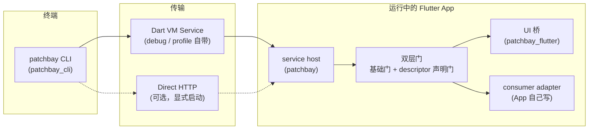
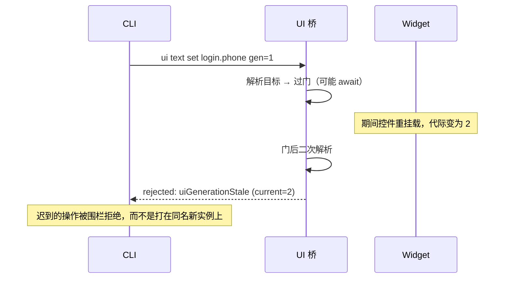
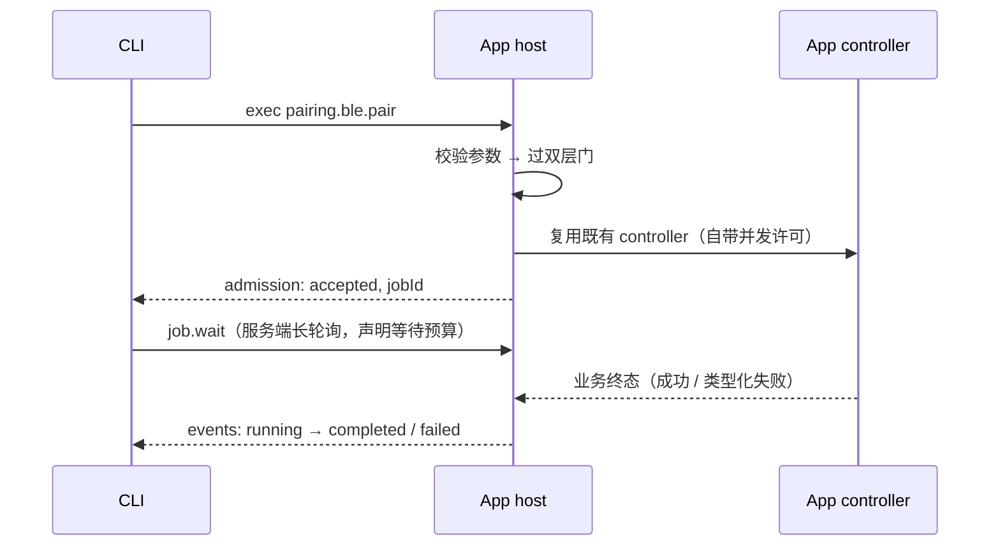

# 设计

> 本文回答"为什么长这样"。怎么用见 [使用指南](guide.md)。

## 架构

依赖方向是治理边界：`patchbay` 与 `patchbay_cli` 是纯 Dart，`patchbay_flutter` 只依赖
Flutter 与 `patchbay`。接入方（consumer）的设备 SDK、路由字符串和领域词汇不进入这四个 package；
需要这些类型时，先在接入方 adapter 中转成中立 DTO。

## 为什么需要 App 合作接入

Patchbay 不是 adb 那种对任意 App 生效的外部工具：它要求 App 在组合根花约 30 行接入。
这个代价换来三样外部工具原理上给不了的东西：

1. **类型化**——状态和失败是结构化 DTO，不是从日志反推；
2. **有门禁**——每条命令过声明式的门，权限、启动阶段、业务约束由 App 自己裁决；
3. **有编译期边界**——release 不构造这套调试面，而不是用运行时开关把它“藏起来”；最终产物由
   接入方构建链继续验证。

## 六条设计立场

核心协议约束由仓库测试覆盖；依赖 App 构建链或真机行为的部分，需要接入方在自己的流水线中继续验收。
违反这些立场的改动应先修改设计，而不是静默放宽实现。

### 1. 受理 ≠ 执行

信封只表达桥接受没接受请求（`admission: accepted | rejected`），从不提供
`ok` / `success` / `executed` 这类会被误读成"设备做完了"的外层字段。业务结果进
payload，带自己的证据等级。CLI 退出码同构：`0` 只代表"App 受理且返回非失败结果"，
业务失败是 `6`，两者不混。

**为什么**：调试工具最大的危害不是失败，而是让人误信成功。一条"命令已发送"被读成
"设备已执行"，联调就会在错误的前提上浪费一天。

### 2. 事实来源是封闭词表

每个状态值标明出处：`appRecorded`（App 记账）、`commandEcho`（命令回显）、
`deviceReported`（设备上报）、`uiObserved`（UI 直接观测）、`unknown`。弱来源不允许
被传输层或 CLI 升级——命令回显永远不冒充设备状态。descriptor 声明每条命令可能出现
的来源集合（`factSources`），客户端可以拒绝词表外的值而不是猜。

### 3. 门是声明的，不是散落的

不可省略的基础门之外，每条命令的 descriptor 声明它需要的 consumer 门（启动阶段、
依赖就绪、业务约束）。目录是跨进程真源：CLI 帮助和副作用提示从 descriptor 读取；host 强制 command
name 唯一、invocation wire 合法且 `requestId` 一致。领域 adapter 必须使用生成 decoder 或等价 validator
执行参数、敏感输入和声明门校验，不能把 descriptor 只当展示数据。

### 4. release 必须可裁除

组合根用编译期常量确保 release 不注册扩展、不构造 adapter、不保留运行时重开入口。
`PatchbayKey` 在所有构建模式保持同一种 GlobalKey 语义，release 只裁掉调试声明和登记逻辑，
避免因为 Key 类型变化造成 Widget state 漂移。

通用 package 无法替任意 App 证明最终 AOT 产物。接入方必须在自己的构建链中扫描 release 产物，
确认 host、descriptor、operator 和业务 callback 均不可达。

### 5. UI 操作低侵入、防误击

只读诊断可以观察 Widget / Render / Semantics 树，但写操作不把文案、坐标、树路径或节点顺序当作
稳定身份：只操作带代际信息的 `PatchbayKey` target 或明确选中的 Semantics 节点。每个目标带
代际（generation）：

同 ID 多个 mounted 目标一律 fail-closed（歧义拒绝），不按树顺序选。

### 6. 慢事实用 job 表达

配网、连接这类长流程不伪装成即时命令：受理即返回 `jobId`，事件带单调序号与事实
来源，取消 / 超时 / 代际失效都有类型化终态。等待是服务端长轮询（客户端声明预算，
服务端夹紧到上限），不是客户端刷屏轮询。

Job ledger 使用两个独立的有限预算：`maxRunningJobs` 限制正在执行的任务，`retainedJobs` 限制可回读的
已结束任务。取消 callback 也有等待上限；超时只表示取消未被确认，不能据此写入 cancelled 终态。
没有 callback 同样不能写 cancelled；callback 返回是 consumer 对“底层操作已停止”的证明，不只是取消
请求已经发出。

## 传输选型

- **主通道 VM Service**：debug/profile 天然存在，零额外监听面，与 DevTools 共用。
- **可选直连 HTTP**（`patchbay_transport`）：为"没有 VM Service 端口转发"的场景准备。
  构造惰性、显式启动、短期 bearer、identity 漂移即关闭；明文、无 TLS，仅限受信网络
  实验用途。选择短连接 HTTP 而非 WebSocket，是因为现有能力都是有界 request/response，
  更小的状态面便于严格限制 body、超时和并发。

## 非目标（红线）

- 不做任意坐标驱动，也不从全树扫描结果猜测稳定写操作目标；
- 不重造 hot reload / DevTools（DevTools 能力走转发，标 `flutterSdkPassthrough` + SDK
  漂移警告）；
- 不支持 release 构建，不建立任何降级通道；
- 系统权限弹窗、装卸包、进程管理不做——那是 adb / xcrun 的地盘。

历次对红线的推翻与放宽都记录在 `packages/patchbay/README.md` 的非目标台账，
带裁决理由，不静默改写。
